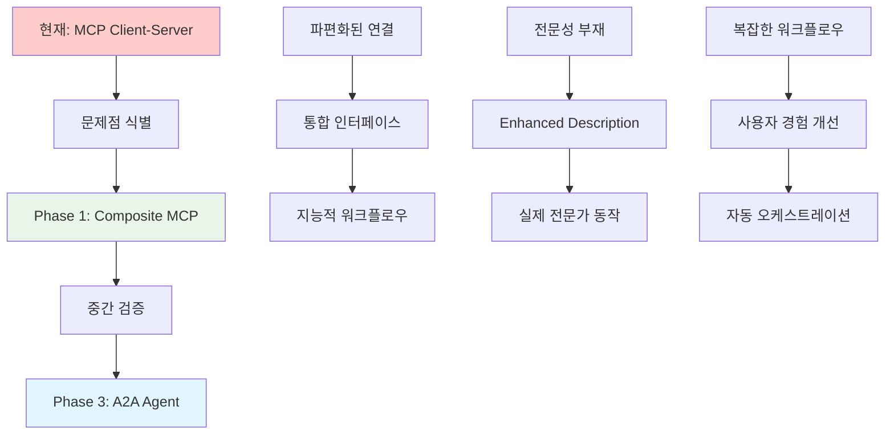
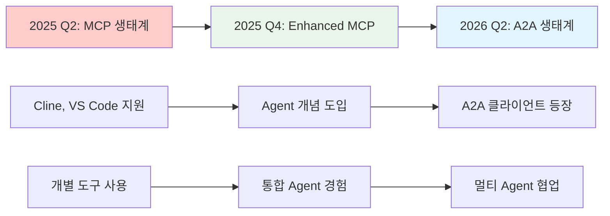
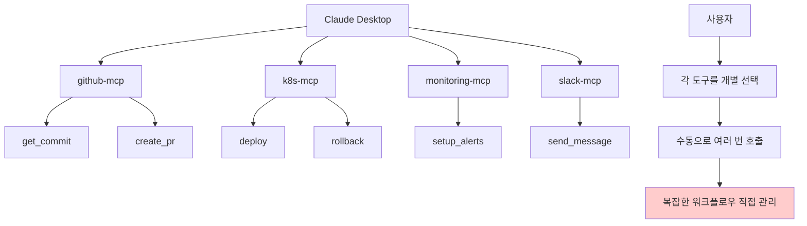
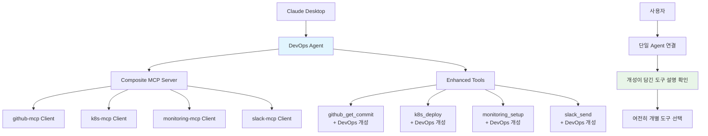
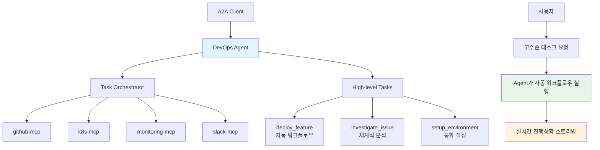
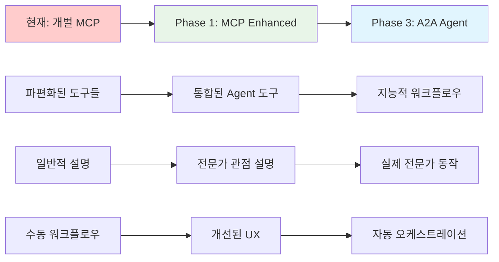

# MCP Orchestrator - Agent Evolution PRD

## 1. 제품 개요

### 1.1 진화 방향
MCP Orchestrator를 **MCP 기반 Agent 플랫폼**으로 진화시켜, 현재 MCP 생태계의 장점을 유지하면서 미래 A2A 생태계로의 자연스러운 마이그레이션 경로를 제공

### 1.2 핵심 가치 제안
- **Agent = MCP 조합 + 시스템 프롬프트**: 기존 MCP 서버들을 Agent의 도구로 활용
- **이중 프로토콜 지원**: MCP 모드(개별 도구)와 A2A 모드(고수준 태스크) 동시 제공
- **점진적 진화**: Phase 2(복잡한 LLM 오케스트레이션) 스킵하고 직접 A2A로 진화

### 1.3 Agent 정의
```
Agent = 개성/전문성(시스템 프롬프트) + 도구들(MCP 서버 조합)

예시:
DevOps Engineer Agent = "신중하고 자동화를 선호하는 시니어 DevOps" + [github-mcp, k8s-mcp, monitoring-mcp, slack-mcp]
```

## 2. 핵심 개념 및 진화 과정

### 2.1 핵심 개념 정의

### 2.1 핵심 개념 정의

#### MCP Client-Server 구조 (현재 표준)
| 컴포넌트 | 역할 | 특징 | 한계점 |
|----------|------|------|--------|
| **MCP Client** | 도구 소비자 (Cline, Claude Desktop) | - 여러 MCP 서버 연결<br/>- 도구 발견 및 호출<br/>- 사용자 인터페이스 제공 | - 각 서버별 개별 연결 관리<br/>- 복합 워크플로우 직접 처리<br/>- 30-120초 타임아웃 제약 |
| **MCP Server** | 도구 제공자 (github-mcp, k8s-mcp) | - 특정 도메인 전문 도구<br/>- 표준 JSON-RPC 프로토콜<br/>- 독립적 실행 환경 | - 도메인별 파편화<br/>- 상호 협력 불가<br/>- 전문가 관점 부재 |

#### Composite MCP (Enhanced) - Phase 1 진화
| 특징 | 설명 | 왜 필요한가? | 준비하는 것 |
|------|------|-------------|-------------|
| **통합 인터페이스** | 여러 MCP를 단일 서버로 묶음 | 클라이언트 연결 복잡성 해결 | A2A Agent의 도구 통합 경험 |
| **Enhanced Description** | 원본 + Agent 개성 결합 | 전문가 관점 부여 | A2A Agent의 지능적 동작 준비 |
| **패스스루 아키텍처** | 판단 없이 단순 전달 | 타임아웃 안전성 확보 | A2A 오케스트레이션 신뢰성 |
| **네임스페이스 관리** | `mcp_tool` 형태로 도구 구분 | 도구 충돌 방지 | A2A 멀티 도메인 협업 기반 |

#### A2A Agent - Phase 3 목표
| 특징 | 설명 | Composite MCP와 차이점 | 왜 최종 목표인가? |
|------|------|----------------------|-----------------|
| **지능적 오케스트레이션** | LLM 기반 워크플로우 실행 | 패스스루 → 능동적 판단 | 진정한 전문가 시뮬레이션 |
| **비동기 태스크 처리** | 장시간 작업 스트리밍 지원 | 동기 호출 → 비동기 협업 | 타임아웃 문제 근본 해결 |
| **Agent 간 협업** | 다른 Agent와 작업 위임 | 단일 Agent → 멀티 Agent | 복잡한 비즈니스 프로세스 자동화 |
| **고수준 인터페이스** | 자연어 태스크 → 자동 실행 | 개별 도구 → 통합 솔루션 | 사용자 생산성 혁신 |

### 2.2 점진적 진화가 필요한 이유

#### 기술적 진화 논리


#### 각 단계별 준비 요소
| Phase 1에서 준비 | Phase 3에서 활용 | 점진적 필요성 |
|-----------------|-----------------|---------------|
| **Agent 개념 정립** | 실제 지능적 Agent 구현 | 사용자의 Agent 개념 학습 |
| **시스템 프롬프트 검증** | LLM 기반 동작 지침 | 효과적인 프롬프트 패턴 발견 |
| **MCP 조합 경험** | 자동 오케스트레이션 | 최적 워크플로우 패턴 학습 |
| **통합 UI/UX** | A2A 인터페이스 | 사용자 기대치 및 사용 패턴 |
| **인프라 기반** | 확장성 및 안정성 | 멀티 Agent 시스템 준비 |

### 2.3 왜 바로 A2A로 갈 수 없는가?

#### 기술적 장벽
| 영역 | 현재 상황 | 직접 A2A 시 리스크 | Phase 1 경유 이점 |
|------|----------|------------------|------------------|
| **생태계 성숙도** | A2A 클라이언트 부족 | 사용자 없음 | 기존 MCP 클라이언트 활용 |
| **오케스트레이션 복잡성** | 검증된 패턴 부족 | 예측 불가능한 동작 | 단순한 패스스루로 안정성 확보 |
| **사용자 학습 곡선** | Agent 개념 생소 | 급격한 변화 거부감 | 점진적 Agent 경험 제공 |
| **비즈니스 검증** | ROI 불분명 | 대규모 투자 리스크 | 최소 투자로 가치 검증 |

#### 시장 준비도


### 2.2 현재 MCP 구조의 한계



**현재 문제점:**
- 사용자가 복잡한 워크플로우를 직접 관리
- 각 MCP 서버별로 개별 연결 필요
- 전문가 관점이나 모범 사례 부재

### 2.3 MCP Enhanced (Phase 1) 구조



**Phase 1 개선점:**
- 단일 Agent로 통합된 연결
- 모든 도구에 전문가 관점 부여
- 일관된 개성과 모범 사례 제시

### 2.4 Agent (Phase 3) 구조



**Phase 3 혁신:**
- 고수준 태스크로 간단한 요청
- Agent가 지능적 워크플로우 실행
- 실시간 협업 및 진행상황 공유

### 2.5 진화가 필요한 이유

| 현재 상황 | 문제점 | Phase 1 해결 | Phase 3 해결 |
|-----------|--------|-------------|-------------|
| **도구 파편화** | 각 MCP 개별 관리 | ✅ 통합 Agent 연결 | ✅ 유지 |
| **전문성 부재** | 일반적인 도구 설명 | ✅ Enhanced Description | ✅ 실제 동작에 반영 |
| **복잡한 워크플로우** | 수동 조합 필요 | ⚠️ 여전히 수동 | ✅ 자동 오케스트레이션 |
| **클라이언트 타임아웃** | 여러 도구 연속 호출 시 | ⚠️ 개별 도구는 안전 | ✅ 비동기 태스크로 해결 |
| **협업 제한** | 개별 도구 수준 | ❌ 미지원 | ✅ Agent 간 협업 |

### 2.6 전체 진화 플로우



### 2.7 사용자 경험 비교

#### 현재 MCP (배포 시나리오)
```
1. github-mcp 연결 → get_latest_commit 호출
2. monitoring-mcp 연결 → setup_alerts 호출  
3. k8s-mcp 연결 → deploy 호출
4. slack-mcp 연결 → send_message 호출

총 4개 서버 연결, 4번 도구 호출, 사용자가 순서 관리
```

#### Phase 1 (MCP Enhanced)
```
1. DevOps Agent 연결 (단일)
2. github_get_commit (DevOps 관점 설명) 호출
3. monitoring_setup_alerts (DevOps 모범사례) 호출
4. k8s_deploy (blue-green 전략 권장) 호출
5. slack_send_message (상세 메트릭 포함) 호출

단일 Agent 연결, 전문가 가이드, 여전히 4번 호출
```

#### Phase 3 (A2A Agent)
```
1. DevOps Agent 연결
2. "deploy_feature_professionally" 단일 요청
3. Agent가 내부적으로 4개 도구 조합 실행
4. 실시간 진행상황 스트리밍 수신

단일 연결, 단일 요청, 자동 워크플로우
```

## 3. 핵심 아키텍처

### 3.1 Agent 정의 구조
```
Project
├── MCP Servers (기존)
│   ├── github-mcp
│   ├── database-mcp  
│   └── slack-mcp
└── Agents (신규)
    ├── DevOps Engineer
    │   ├── System Prompt: "You are a senior DevOps engineer..."
    │   ├── Child MCPs: [github-mcp, k8s-mcp, monitoring-mcp, slack-mcp]
    │   ├── MCP Mode: /projects/{id}/agents/{agent_id}/mcp
    │   └── A2A Mode: /projects/{id}/agents/{agent_id}/a2a
    └── Backend Developer
        ├── System Prompt: "You are a backend developer..."
        └── Child MCPs: [github-mcp, database-mcp, testing-mcp]
```

### 3.2 이중 프로토콜 지원
```
동일한 Agent 설정으로 두 가지 모드 제공:

MCP Mode (Phase 1):
Client → Enhanced MCP Server → Individual Tools → Child MCP Servers

A2A Mode (Phase 3): 
Client → A2A Agent → High-level Tasks → Multiple MCP Coordination
```

## 4. Phase별 구현 계획

### Phase 1: MCP Enhanced Description (3주)
**목표**: 기존 MCP 도구들에 Agent 개성을 부여한 Composite MCP 서버 구현

### 4.1 핵심 기능
- Agent 정의 및 관리 (시스템 프롬프트 + MCP 조합)
- Enhanced Description: 기존 MCP 도구 설명에 Agent 개성 추가
- 단순 패스스루: Agent MCP가 요청을 child MCP로 직접 전달
- 프로젝트별 Agent 관리 UI

### 4.2 사용자 경험
```
사용자 관점:
1. Agent 생성: "DevOps Engineer" + 시스템 프롬프트 + MCP 선택
2. Cline 연결: 단일 MCP 서버로 인식
3. 도구 목록: github_get_commit, k8s_deploy, slack_send... (15-20개)
4. 각 도구에 Agent 개성이 담긴 설명 표시
5. 개별 도구 호출 시 즉시 응답 (타임아웃 안전)
```

### Phase 3: A2A 프로토콜 지원 (4주)
**목표**: A2A 프로토콜 지원으로 진정한 Agent 간 협업 구현

### 4.3 핵심 기능
- A2A Agent Card 생성 및 Discovery
- 고수준 태스크 처리 (여러 MCP 조합 오케스트레이션)
- Agent 간 비동기 통신 및 작업 위임
- 실시간 진행상황 스트리밍

### 4.4 사용자 경험
```
사용자 관점:
1. A2A 클라이언트 연결
2. "새 기능 배포해줘" 한 번 요청
3. Agent가 내부적으로 여러 MCP 조합 실행
4. 실시간 진행상황 스트리밍 수신
5. 다른 Agent와의 협업 가능
```

## 5. 데이터 모델

### 5.1 Agent 모델
```sql
CREATE TABLE agents (
    id VARCHAR PRIMARY KEY,
    project_id VARCHAR REFERENCES projects(id),
    name VARCHAR NOT NULL,                    -- "DevOps Engineer"
    description TEXT NOT NULL,                -- 시스템 프롬프트/개성
    child_mcps JSON NOT NULL,                -- ["github-mcp", "k8s-mcp"]
    protocol_modes JSON DEFAULT '["mcp"]',   -- ["mcp", "a2a"]
    created_at TIMESTAMP DEFAULT NOW(),
    updated_at TIMESTAMP DEFAULT NOW()
);
```

### 5.2 Agent 설정 예시
```json
{
  "id": "devops-engineer-001",
  "name": "DevOps Engineer", 
  "description": "You are a senior DevOps engineer specialized in automated deployments. GUIDELINES: - Always verify monitoring before deployment - Prefer blue-green deployments for production - Include performance metrics in notifications",
  "child_mcps": ["github-mcp", "k8s-mcp", "monitoring-mcp", "slack-mcp"],
  "protocol_modes": ["mcp", "a2a"]
}
```

## 6. API 설계

### 6.1 Agent 관리 API
```python
# Agent CRUD
GET    /api/projects/{project_id}/agents           # Agent 목록
POST   /api/projects/{project_id}/agents           # Agent 생성
GET    /api/projects/{project_id}/agents/{agent_id} # Agent 상세
PUT    /api/projects/{project_id}/agents/{agent_id} # Agent 수정
DELETE /api/projects/{project_id}/agents/{agent_id} # Agent 삭제

# 클라이언트 설정 생성
GET    /api/projects/{project_id}/agents/{agent_id}/config?mode=mcp
GET    /api/projects/{project_id}/agents/{agent_id}/config?mode=a2a
```

### 6.2 프로토콜 엔드포인트
```python
# Phase 1: MCP 프로토콜
GET    /projects/{project_id}/agents/{agent_id}/mcp/sse      # MCP SSE
POST   /projects/{project_id}/agents/{agent_id}/mcp/messages # MCP 메시지

# Phase 3: A2A 프로토콜  
GET    /projects/{project_id}/agents/{agent_id}/a2a          # Agent Card
POST   /projects/{project_id}/agents/{agent_id}/a2a/tasks    # A2A 태스크
GET    /projects/{project_id}/agents                         # A2A Discovery
```

## 7. 아키텍처 결정 및 대안 검토

### 7.1 Phase 2 (LLM 오케스트레이션) 스킵 결정

#### 검토했던 Phase 2 안
- LLM이 사용자 요청을 분석해서 여러 MCP 도구 자동 조합 실행
- 예: "배포해줘" → LLM이 github_get_commit + k8s_deploy + monitoring_setup + slack_notify 순서로 자동 실행
- Agent가 시스템 프롬프트를 바탕으로 지능적 판단 후 여러 도구 조합

#### 스킵 결정 이유
1. **타임아웃 위험 급증**: 여러 도구 조합 시 30-120초 클라이언트 타임아웃 초과 가능성
   - 단일 도구: 평균 5-15초 (안전)
   - 조합 실행: 30-60초 (위험) 
2. **구현 복잡성**: LLM 판단 로직의 예측 불가능성 및 에러 처리 복잡성
3. **A2A 우선순위**: 동일한 가치를 A2A 프로토콜에서 더 우아하게 구현 가능
4. **사용자 피드백 우선**: Phase 1으로 먼저 사용자 반응 및 사용 패턴 확인

#### 향후 재검토 조건
- A2A 생태계 활성화가 지연될 경우 (2026년 이후)
- 사용자가 명시적으로 자동 조합 기능을 강력히 요청할 경우
- 스트리밍 응답이나 백그라운드 처리로 타임아웃을 해결할 기술적 돌파구 발견 시
- 클라이언트들이 장시간 작업을 지원하기 시작할 경우

### 7.2 Phase 1 vs Phase 3 차이점 명확화

| 구분 | Phase 1 (MCP Mode) | Phase 3 (A2A Mode) |
|------|---------------------|---------------------|
| 사용자 인터페이스 | 개별 도구 선택 (15-20개) | 고수준 태스크 요청 |
| Agent 역할 | 도구 설명 enhancement만 | 실제 워크플로우 조합 실행 |
| 실행 방식 | 완전 패스스루 (단순 전달) | 여러 MCP 조합 오케스트레이션 |
| 타임아웃 위험 | 개별 도구는 안전, 수동 조합 시 위험 | 비동기 태스크로 해결 |
| 지능성 | Description에만 반영 | 실제 동작에서 구현 |

## 7. Phase 1 상세 구현

### 7.1 Phase 1의 정확한 동작 방식

#### Enhanced Description 생성 로직
```python
def enhance_description(self, original_tool, mcp_name):
    return f"""
🤖 {self.agent.name} Agent Context:
{self.agent.description}

Original Tool: {original_tool['description']}

Usage with Agent Personality:
When using this tool, it will be executed with {self.agent.name} expertise and mindset as described above.
"""
```

#### 네임스페이스 및 패스스루 방식
```python
async def list_tools(self):
    tools = []
    for mcp_name, client in self.mcp_clients.items():
        original_tools = await client.list_tools()
        for tool in original_tools:
            tools.append({
                "name": f"{mcp_name}_{tool['name']}", # 네임스페이스 추가
                "description": self.enhance_description(tool, mcp_name),
                "input_schema": tool["input_schema"] # 원본 그대로 유지
            })
    return tools

async def call_tool(self, tool_name, arguments):
    # 완전한 패스스루 - Agent는 판단하지 않고 단순 전달
    mcp_name, actual_tool = tool_name.split("_", 1)
    mcp_client = self.mcp_clients[mcp_name]
    return await mcp_client.call_tool(actual_tool, arguments)
```

#### Phase 1의 한계점
- **도구 선택 복잡성**: 사용자가 15-20개 도구 중 적절한 것 선택 필요
- **수동 조합**: 여러 작업 시 사용자가 직접 여러 도구를 순차 호출
- **제한적 지능성**: Agent 개성이 description에만 반영, 실제 동작은 변화 없음
- **여전한 타임아웃 위험**: 사용자가 수동으로 여러 도구를 연속 호출할 경우

### 7.2 Composite MCP Server
```python
class CompositeMCPServer:
    def __init__(self, agent_config, mcp_clients):
        self.agent = agent_config
        self.mcp_clients = mcp_clients
    
    async def list_tools(self):
        enhanced_tools = []
        
        for mcp_name, mcp_client in self.mcp_clients.items():
            original_tools = await mcp_client.list_tools()
            
            for tool in original_tools:
                enhanced_tools.append({
                    "name": f"{mcp_name}_{tool['name']}",
                    "description": self.enhance_description(tool, mcp_name),
                    "input_schema": tool["input_schema"]
                })
        
        return {"tools": enhanced_tools}
    
    def enhance_description(self, original_tool, mcp_name):
        return f"""
        🤖 {self.agent.name} Agent Context:
        {self.agent.description}
        
        Tool: {original_tool['description']}
        
        When using this tool, the agent will apply {self.agent.name} expertise and follow the personality guidelines above.
        """
    
    async def call_tool(self, tool_name, arguments):
        # 단순 패스스루
        mcp_name, actual_tool = tool_name.split("_", 1)
        mcp_client = self.mcp_clients[mcp_name]
        return await mcp_client.call_tool(actual_tool, arguments)
```

### 7.3 동적 엔드포인트 생성
```python
class AgentEndpointManager:
    def create_mcp_endpoint(self, project_id, agent_id):
        agent = self.get_agent(project_id, agent_id)
        
        # child MCP 클라이언트들 초기화
        mcp_clients = {}
        for mcp_name in agent.child_mcps:
            mcp_clients[mcp_name] = self.get_mcp_client(project_id, mcp_name)
        
        # Composite MCP 서버 생성
        composite_server = CompositeMCPServer(agent, mcp_clients)
        
        return composite_server
```

## 8. Phase 3 상세 구현

### 8.1 A2A Agent
```python
class A2AAgent:
    def __init__(self, agent_config, mcp_clients):
        self.agent = agent_config
        self.mcp_clients = mcp_clients
    
    def get_agent_card(self):
        return {
            "name": self.agent.name,
            "description": self.agent.description,
            "capabilities": self.extract_capabilities(),
            "endpoints": {
                "tasks": f"/projects/{self.agent.project_id}/agents/{self.agent.id}/a2a/tasks"
            }
        }
    
    async def handle_task(self, task_description, arguments):
        # 고수준 태스크를 여러 MCP 조합으로 처리
        workflow = self.plan_workflow(task_description)
        
        async for progress in self.execute_workflow(workflow, arguments):
            yield progress
    
    async def execute_workflow(self, workflow, arguments):
        results = {}
        
        for step in workflow:
            yield f"🔄 Executing {step['description']}..."
            
            mcp_client = self.mcp_clients[step['mcp']]
            result = await mcp_client.call_tool(step['tool'], step['args'])
            
            results[step['name']] = result
            yield f"✅ {step['description']} completed"
        
        yield f"🎉 All tasks completed successfully!"
        return results
```

### 8.2 Agent 간 통신
```python
class A2AProtocolHandler:
    async def discover_agents(self, project_id):
        agents = await self.agent_service.list_agents(project_id)
        return [agent.get_agent_card() for agent in agents]
    
    async def delegate_task(self, from_agent, to_agent, task):
        target_agent = self.get_agent(to_agent['id'])
        return await target_agent.handle_task(task['description'], task['arguments'])
```

## 9. UI 설계

### 9.1 프로젝트 네비게이션 확장
```
Project Detail Page
├── Overview
├── Members  
├── Servers (기존 MCP)
├── Agents (신규)     ← 새로운 탭
├── Tools
├── Activity
└── Settings
```

### 9.2 Agent 생성 UI
```
┌─ Create Agent ─────────────────────────┐
│                                        │
│ Agent Name: [DevOps Engineer        ]  │
│                                        │
│ System Prompt & Personality:           │
│ ┌────────────────────────────────────┐ │
│ │ You are a senior DevOps engineer   │ │
│ │ specialized in automated           │ │
│ │ deployments.                       │ │
│ │                                    │ │
│ │ GUIDELINES:                        │ │
│ │ - Always verify monitoring first   │ │
│ │ - Use blue-green for production    │ │
│ │ - Include metrics in notifications │ │
│ └────────────────────────────────────┘ │
│                                        │
│ Available MCP Tools:                   │
│ ☑ github-mcp                          │
│ ☑ k8s-mcp                             │
│ ☑ monitoring-mcp                      │
│ ☑ slack-mcp                           │
│ ☐ jira-mcp                            │
│                                        │
│ Protocol Support:                      │
│ ☑ MCP Mode (Individual Tools)         │
│ ☑ A2A Mode (High-level Tasks)         │
│                                        │
│           [Create Agent]               │
└────────────────────────────────────────┘
```

### 9.3 Agent 상세 페이지
```
Agent: DevOps Engineer
├── Overview (개성, 설명, 통계)
├── Configuration (시스템 프롬프트, child MCPs)
├── Client Setup (MCP/A2A 설정 자동 생성)
└── Activity (사용 로그, 성능 메트릭)
```

## 10. 워크플로우 및 TODO

### Phase 1: MCP Enhanced Description (3주)

#### Week 1: 데이터 모델 및 기본 API
**목표**: Agent 정의 및 관리 기능 구현

**Backend Tasks**:
- [ ] Agent 데이터 모델 정의 및 마이그레이션
- [ ] Agent CRUD API 구현
  - [ ] `POST /api/projects/{id}/agents` - Agent 생성
  - [ ] `GET /api/projects/{id}/agents` - Agent 목록
  - [ ] `GET /api/projects/{id}/agents/{agent_id}` - Agent 상세
  - [ ] `PUT /api/projects/{id}/agents/{agent_id}` - Agent 수정
  - [ ] `DELETE /api/projects/{id}/agents/{agent_id}` - Agent 삭제
- [ ] Agent validation 로직 (child_mcps 존재 여부 등)
- [ ] 기존 프로젝트-MCP 관계와의 연동

**Frontend Tasks**:
- [ ] Agents 탭 UI 구현
- [ ] Agent 목록 카드 컴포넌트
- [ ] Agent 생성 모달 (기본 정보만)
- [ ] Agent 상세 페이지 (읽기 전용)

**Testing**:
- [ ] Agent CRUD API 테스트
- [ ] UI 컴포넌트 기본 동작 테스트

#### Week 2: Composite MCP Server 엔진
**목표**: 실제 MCP 프로토콜로 동작하는 Composite 서버 구현

**Backend Tasks**:
- [ ] CompositeMCPServer 클래스 구현
  - [ ] `list_tools()` - Enhanced description 생성
  - [ ] `call_tool()` - 패스스루 로직
  - [ ] Description enhancement 알고리즘
- [ ] MCP 클라이언트 관리자 구현
  - [ ] Child MCP 클라이언트 초기화
  - [ ] 연결 상태 관리
  - [ ] 에러 처리
- [ ] 동적 엔드포인트 생성 시스템
  - [ ] `GET /projects/{id}/agents/{agent_id}/mcp/sse`
  - [ ] `POST /projects/{id}/agents/{agent_id}/mcp/messages`
- [ ] Agent별 JWT 토큰 인증

**Testing**:
- [ ] Composite MCP 서버 단위 테스트
- [ ] 실제 MCP 클라이언트와 통합 테스트
- [ ] Description enhancement 품질 테스트

#### Week 3: UI 완성 및 클라이언트 설정
**목표**: 사용자가 실제 Agent를 생성하고 사용할 수 있는 완성된 UI

**Frontend Tasks**:
- [ ] Agent 생성 모달 완성
  - [ ] 시스템 프롬프트 입력 (rich text editor)
  - [ ] MCP 선택 UI (프로젝트 내 MCP 목록)
  - [ ] 실시간 미리보기
- [ ] Agent 상세 페이지 완성
  - [ ] 설정 편집 기능
  - [ ] 클라이언트 설정 자동 생성
  - [ ] 사용 통계 표시
- [ ] Agent 카드 컴포넌트 완성
  - [ ] Agent 개성 표시
  - [ ] Child MCP 목록
  - [ ] 상태 인디케이터

**Backend Tasks**:
- [ ] 클라이언트 설정 생성 API
  - [ ] `GET /api/projects/{id}/agents/{agent_id}/config?mode=mcp`
  - [ ] Cline, VS Code 등 다양한 형식 지원
- [ ] Agent 사용 통계 수집
- [ ] Error logging 및 모니터링

**Testing & Documentation**:
- [ ] E2E 테스트 (Agent 생성 → Cline 연결 → 도구 사용)
- [ ] 사용자 가이드 문서
- [ ] API 문서 업데이트

### Phase 3: A2A 프로토콜 지원 (4주)

#### Week 1: A2A 프로토콜 기본 구현
**목표**: A2A 프로토콜 스펙에 맞는 기본 구조 구현

**Backend Tasks**:
- [ ] A2A 프로토콜 스펙 연구 및 설계
- [ ] A2AAgent 클래스 구현
  - [ ] `get_agent_card()` - Agent 메타데이터
  - [ ] 기본 capabilities 추출
- [ ] A2A 엔드포인트 구현
  - [ ] `GET /projects/{id}/agents/{agent_id}/a2a` - Agent Card
  - [ ] `GET /projects/{id}/agents` - Discovery
- [ ] JSON-RPC over HTTP 처리

**Testing**:
- [ ] A2A 프로토콜 호환성 테스트
- [ ] Agent Card 생성 테스트

#### Week 2: 고수준 태스크 처리
**목표**: 여러 MCP 조합으로 복합 작업 수행

**Backend Tasks**:
- [ ] Task 처리 엔진 구현
  - [ ] `handle_task()` - 고수준 태스크 받기
  - [ ] Workflow planning 로직
  - [ ] 여러 MCP 조합 실행
- [ ] 스트리밍 응답 시스템
  - [ ] 실시간 진행상황 전송
  - [ ] 부분 결과 전송
- [ ] A2A 태스크 엔드포인트
  - [ ] `POST /projects/{id}/agents/{agent_id}/a2a/tasks`

**Testing**:
- [ ] 복합 워크플로우 테스트
- [ ] 스트리밍 응답 테스트

#### Week 3: Agent 간 통신
**목표**: Agent 간 작업 위임 및 협업

**Backend Tasks**:
- [ ] Agent Discovery 시스템
- [ ] Agent 간 통신 프로토콜
- [ ] Task 위임 로직
  - [ ] 적절한 Agent 선택 알고리즘
  - [ ] 위임 결과 처리
- [ ] 분산 워크플로우 관리

**Testing**:
- [ ] 멀티 Agent 시나리오 테스트
- [ ] Agent 간 통신 안정성 테스트

#### Week 4: A2A 웹 클라이언트 및 최적화
**목표**: A2A 기능을 시연할 수 있는 웹 클라이언트

**Frontend Tasks**:
- [ ] A2A 모드 UI 구현
  - [ ] 고수준 태스크 입력 인터페이스
  - [ ] 실시간 진행상황 표시
  - [ ] Agent 간 협업 시각화
- [ ] A2A 웹 클라이언트 구현
  - [ ] Agent 연결 관리
  - [ ] 태스크 히스토리
  - [ ] 성능 모니터링

**Backend Tasks**:
- [ ] 성능 최적화
- [ ] 에러 처리 강화
- [ ] 로깅 및 모니터링 완성

**Testing & Documentation**:
- [ ] A2A 모드 E2E 테스트
- [ ] 성능 벤치마크
- [ ] A2A 사용자 가이드

## 11. 성공 지표

### Phase 1 성공 지표
- [ ] Agent 생성 시간: 5분 이내
- [ ] Composite MCP 서버 응답 시간: 기존 MCP 대비 +10% 이하
- [ ] 사용자가 Agent 개성을 인지할 수 있는 description 품질
- [ ] 기존 MCP 클라이언트(Cline, VS Code)와 100% 호환성

### Phase 3 성공 지표
- [ ] A2A 태스크 완료 시간: 평균 2분 이내
- [ ] Agent 간 협업 성공률: 90% 이상  
- [ ] 실시간 스트리밍 안정성: 99% 이상
- [ ] 멀티 Agent 워크플로우 지원: 최대 5개 Agent 동시 협업

## 12. 기술 스택

### Backend 확장
- **기존**: FastAPI, PostgreSQL, SQLAlchemy, JWT
- **추가**: 
  - WebSocket/SSE 스트리밍
  - JSON-RPC 2.0 프로토콜
  - 비동기 워크플로우 엔진

### Frontend 확장  
- **기존**: Next.js 14, shadcn/ui, Zustand
- **추가**:
  - Rich text editor (시스템 프롬프트)
  - Real-time streaming UI
  - A2A 클라이언트 컴포넌트

## 13. 리스크 및 대응 방안

### 기술적 리스크
1. **A2A 프로토콜 호환성**: 구글 A2A 스펙 변경 시 대응
   - **대응**: 추상화 레이어로 프로토콜 변경 대응
2. **성능 병목**: 여러 MCP 조합 시 지연
   - **대응**: 비동기 처리 및 캐싱 최적화
3. **복잡성 증가**: Agent 설정의 복잡성
   - **대응**: 템플릿 및 마법사 UI 제공

### 사용자 경험 리스크
1. **Phase 1과 3의 차이 혼란**: 사용자가 두 모드 차이 이해 어려움
   - **대응**: 명확한 UI 구분 및 사용자 가이드
2. **Agent 개성 품질**: 시스템 프롬프트 작성의 어려움
   - **대응**: 템플릿 제공 및 AI 어시스턴트 도움

## 14. 결론

이 PRD는 MCP Orchestrator를 단순한 MCP 관리 도구에서 **지능적 Agent 플랫폼**으로 진화시키는 로드맵을 제시합니다.

**핵심 전략**:
1. **Phase 1**: 기존 MCP 생태계 완전 활용
2. **Phase 2 스킵**: 복잡한 LLM 오케스트레이션 우회  
3. **Phase 3**: A2A 프로토콜로 차세대 Agent 협업

이를 통해 **현재 MCP 사용자를 위한 즉시 가치 제공**과 **미래 A2A 생태계로의 자연스러운 진화**를 모두 달성할 수 있습니다.