# MCP Orchestrator User Onboarding Guide

*A comprehensive guide for new users to get started with MCP Orchestrator*

**Generated:** July 1, 2025  
**Version:** 1.0

## Overview

MCP Orchestrator is a self-hosted MCP server management platform that enables project-based team collaboration. This guide provides a step-by-step walkthrough of all major features through screenshots and detailed explanations.

## 🎯 Onboarding Journey

### Step 1: Initial Landing & Sign Up

#### 1.1 Landing Page
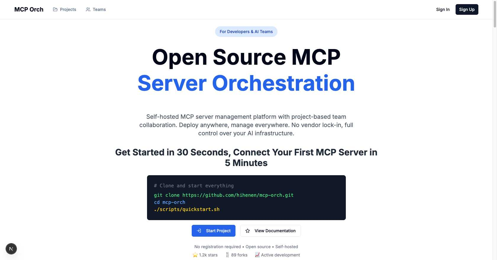

**Screen:** MCP Orch Main Landing Page  
**Key Features:**
- Open Source MCP Server Orchestration introduction
- Self-hosted MCP server management platform overview
- Quick Start guide (30 seconds to start, 5 minutes to connect first MCP server)
- GitHub clone and installation script guide
- Feature showcase and benefits
- **Navigation:** Projects, Teams, Sign In, Sign Up

**Value Proposition:**
- No vendor lock-in, full control over AI infrastructure
- Deploy anywhere, manage everywhere
- Project-based team collaboration

#### 1.2 Sign In Page
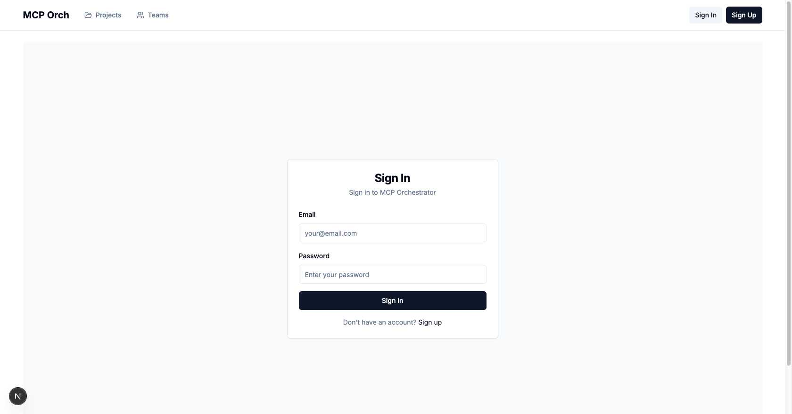

**Screen:** Sign In Page  
**Features:**
- Email/password authentication
- Clean, simple login form
- Link to sign up page for new users

#### 1.3 Sign Up Page
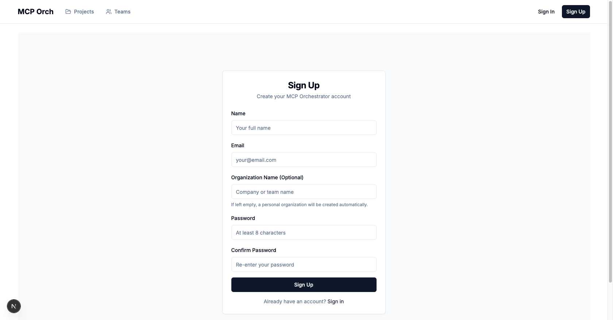

**Screen:** Sign Up Page  
**Features:**
- Name, Email, Organization Name (optional), Password, Confirm Password
- Automatic personal organization creation if organization name is empty
- Link to sign in page for existing users

### Step 2: Projects Dashboard

#### 2.1 Empty Projects Dashboard
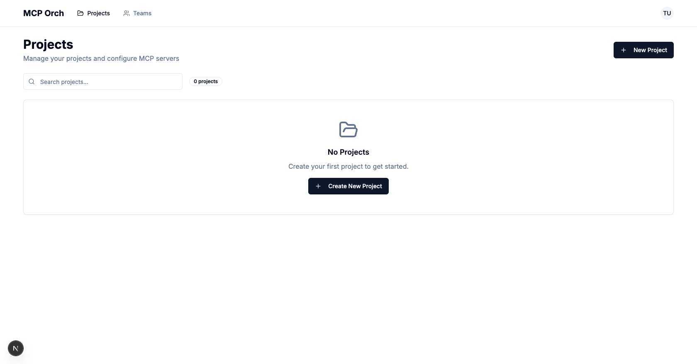

**Screen:** Projects Dashboard (Empty State)  
**Features:**
- Project search functionality
- "New Project" button
- Project statistics (Total Projects, Members, Servers)
- **Empty State:** Clear call-to-action to create first project

#### 2.2 Create Project Modal


**Screen:** Create New Project Modal  
**Features:**
- Project Name and Description fields
- Team selection (Personal/Team project distinction)
- Modal-based project creation form

#### 2.3 Projects Dashboard with Content
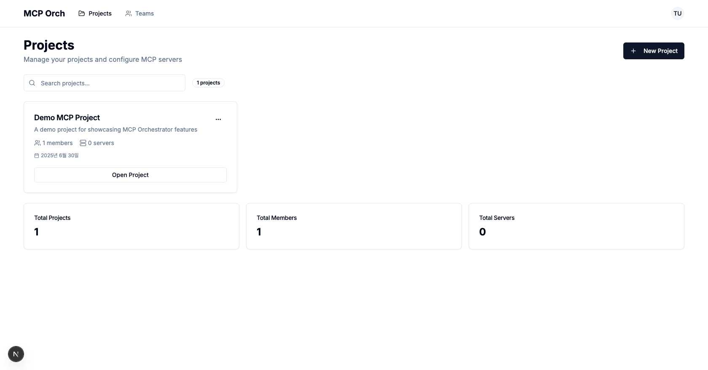

**Screen:** Projects Dashboard (With Projects)  
**Features:**
- Project cards with key information
- Member and server counts per project
- Creation date display
- "Open Project" action button
- **Statistics:** Total Projects: 1, Total Members: 1, Total Servers: 0

### Step 3: Project Management

#### 3.1 Project Overview
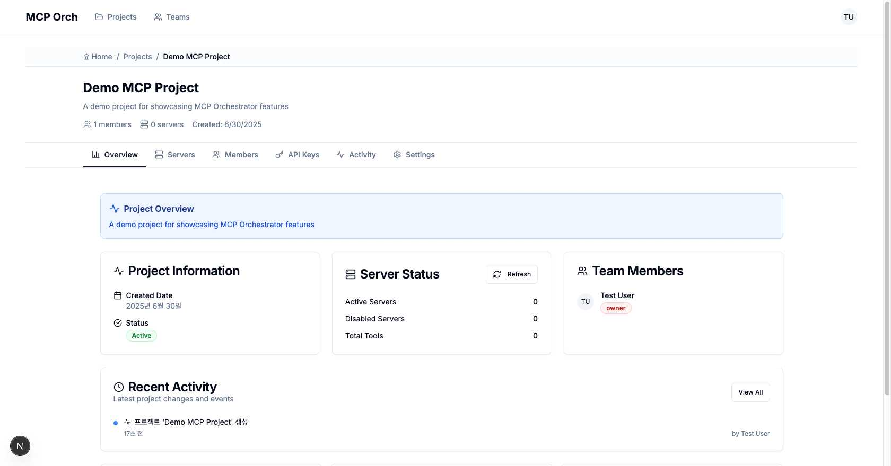

**Screen:** Project Overview Tab  
**Navigation Tabs:** Overview, Servers, Members, API Keys, Activity, Settings

**Key Sections:**
- **Project Information:** Creation date, status, member/server counts
- **Server Status:** Active/Disabled servers, Total tools summary
- **Team Members:** Member list with roles
- **Recent Activity:** Chronological activity log
- **Quick Actions:** Invite Members, Manage Servers, Settings shortcuts

#### 3.2 Servers Management
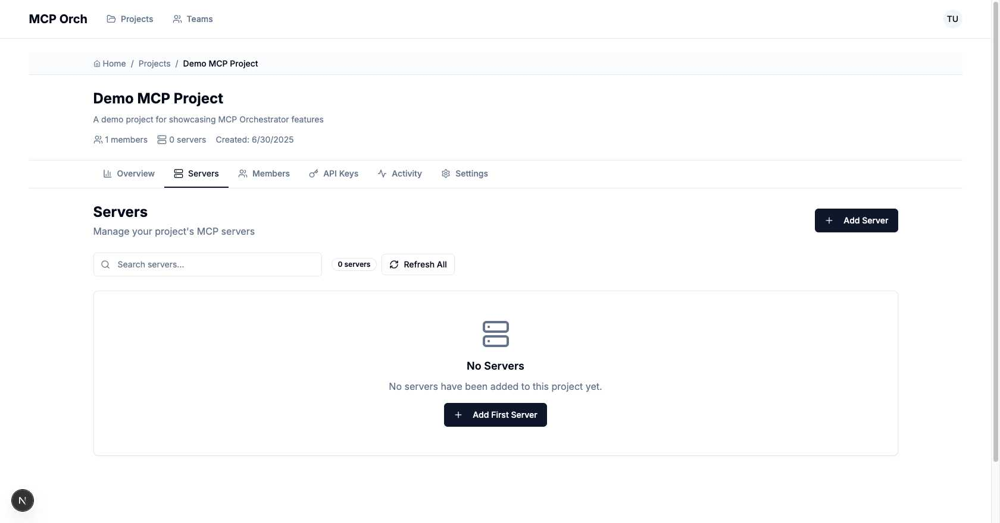

**Screen:** Servers Tab  
**Features:**
- MCP server search and management
- "Add Server" functionality
- "Refresh All" servers action
- **Empty State:** Clear guidance to add first server

#### 3.2.1 Add Server Modal - Individual Add
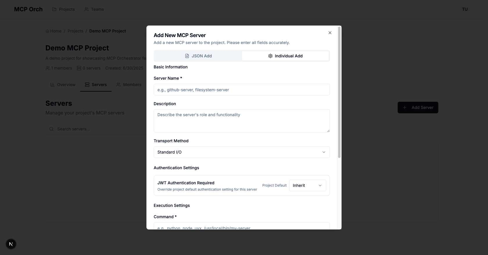

**Screen:** Add New MCP Server Modal (Individual Add Tab)  
**Features:**
- **Server Name:** Descriptive name for the MCP server
- **Command:** Executable command (e.g., npx, python, node)
- **Arguments:** Command-line arguments for server execution
- **Environment Variables:** Key-value pairs for server configuration
- **Disabled Option:** Ability to add but keep server inactive
- **Form Validation:** Real-time validation for required fields

**Usage:** Ideal for adding single servers with step-by-step configuration

#### 3.2.2 Add Server Modal - JSON Add
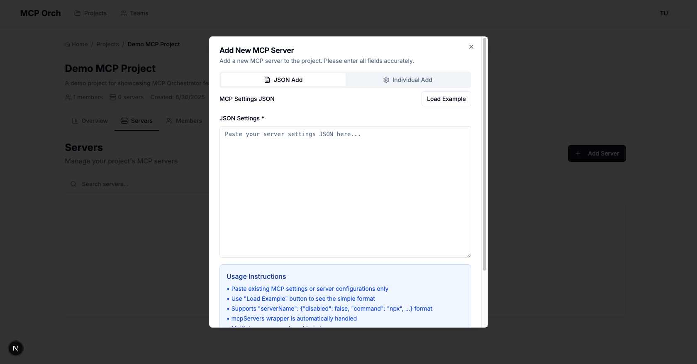

**Screen:** Add New MCP Server Modal (JSON Add Tab)  
**Features:**
- **JSON Settings:** Paste existing MCP server configurations
- **Load Example:** Quick access to sample JSON format
- **Bulk Addition:** Add multiple servers simultaneously
- **Format Support:** Compatible with standard MCP settings format
- **Usage Instructions:** Clear guidance on JSON structure

**Supported Format:**
```json
{
  "serverName": {
    "disabled": false,
    "command": "npx",
    "args": ["-y", "@example/mcp-server"]
  }
}
```

**Usage:** Perfect for importing existing configurations or bulk server setup

#### 3.2.3 Server Form Completion
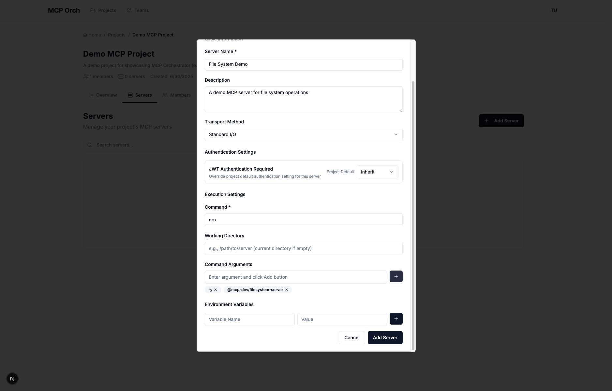

**Screen:** Add Server Modal with Completed Form  
**Features:**
- **Complete Server Configuration:** All required fields filled
- **Server Name:** "File System Demo" 
- **Description:** Detailed explanation of server purpose
- **Command Settings:** npx with proper arguments (-y, @mcp-dev/filesystem-server)
- **Authentication:** Project default inheritance
- **Form Validation:** Real-time validation with submit-ready state

**Usage Flow:**
1. Fill Basic Information (name, description)
2. Configure Authentication Settings (usually inherit project default)
3. Set Execution Settings (command, working directory, arguments)
4. Add Environment Variables (if needed)
5. Submit to create server

#### 3.3 API Keys Management
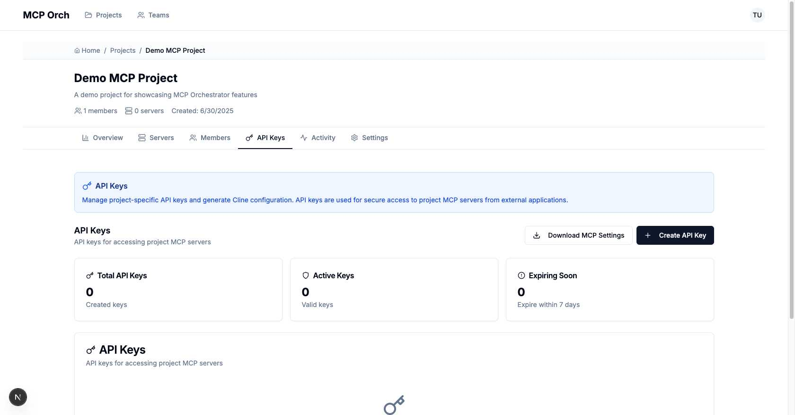

**Screen:** API Keys Tab  
**Features:**
- Project-specific API key management
- "Download MCP Settings" for client configuration
- API key creation and management
- Automatic Cline configuration generation
- **Statistics:** Total API Keys, Active Keys, Expiring Soon counters
- **Empty State:** Guidance to create first API key

#### 3.4 Activity Logging
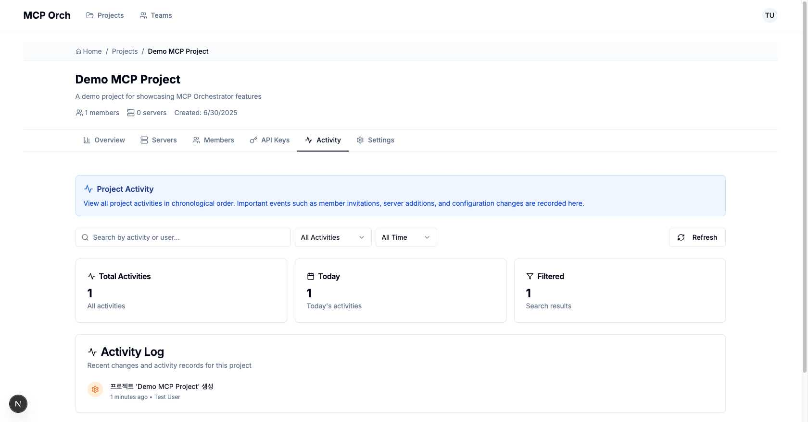

**Screen:** Activity Tab  
**Features:**
- Chronological project activity display
- Activity search and filtering (All Activities, All Time)
- Activity statistics (Total Activities, Today, Filtered)
- **Current Activity:** Shows project creation activity

#### 3.5 Project Settings
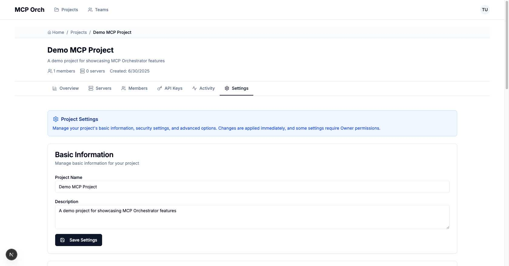

**Screen:** Settings Tab  
**Key Sections:**

**Basic Information:**
- Project name and description editing

**MCP Server Operation Mode:**
- Unified vs Individual mode selection (BETA feature)
- Mode benefits explanation

**Security Settings:**
- JWT authentication policy
- IP restrictions (coming soon)

**Danger Zone:**
- Project deletion functionality

### Step 4: Team Management

#### 4.1 Teams Dashboard
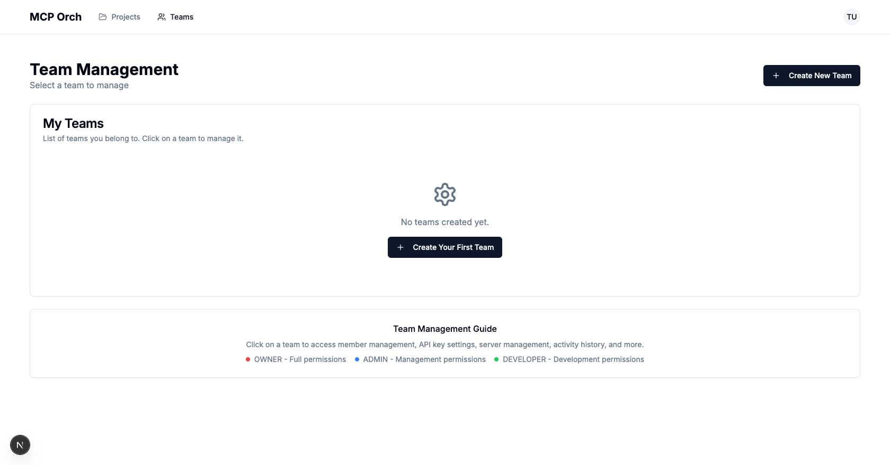

**Screen:** Teams Page  
**Features:**
- Team creation and management
- Team member role management (OWNER, ADMIN, DEVELOPER)
- **Empty State:** Guidance to create first team

**Role Definitions:**
- **OWNER:** Full permissions
- **ADMIN:** Management permissions  
- **DEVELOPER:** Development permissions

### Step 5: User Profile

#### 5.1 User Profile Menu
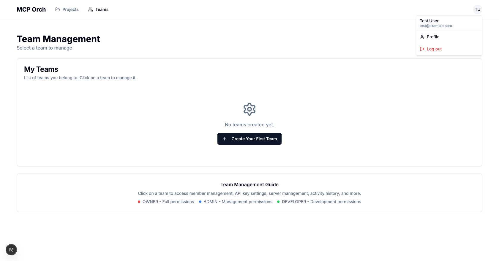

**Screen:** User Dropdown Menu  
**Features:**
- User information display (name, email)
- Profile page link
- Logout functionality

## 🚀 Recommended Onboarding Flow

### Phase 1: First Visit & Registration
1. **Landing Page** → Review MCP Orchestrator value proposition
2. **Sign Up** → Create account with organization details
3. **Email Verification** → Complete account setup
4. **Sign In** → Access the platform

### Phase 2: First Project Setup
1. **Projects Dashboard** → Understand project-based organization
2. **Create Project** → Set up first project with description
3. **Project Overview** → Familiarize with project structure
4. **Explore Tabs** → Navigate through all project features

### Phase 3: MCP Server Configuration
1. **Servers Tab** → Navigate to server management section
2. **Add Server Modal** → Choose between Individual Add or JSON Add
3. **Individual Add** → Fill form fields for single server setup
4. **JSON Add** → Paste existing configurations for bulk import
5. **Server Validation** → Review server settings before submission
6. **Server Testing** → Verify server connectivity and functionality

### Phase 4: Client Integration
1. **API Keys Tab** → Create first API key
2. **Download Settings** → Get MCP configuration file
3. **Client Setup** → Configure Cursor, Cline, or other MCP clients
4. **Test Connection** → Verify end-to-end functionality

### Phase 5: Team Collaboration (Optional)
1. **Teams Page** → Create team if needed
2. **Invite Members** → Add team members with appropriate roles
3. **Project Transfer** → Move project to team or create team project

## 💡 Key UX Insights

### Excellent Empty States
- Every empty state provides clear guidance and call-to-action
- Users are never left wondering what to do next
- Progressive disclosure guides users through the complexity

### Intuitive Navigation
- Consistent tab-based navigation within projects
- Clear breadcrumbs and page hierarchy
- Logical flow from projects → teams → settings

### Self-Service Onboarding
- No external documentation required for basic setup
- Embedded guidance and tooltips
- Smart defaults and optional fields

### Professional UI/UX
- Clean, modern interface design
- Consistent visual language
- Responsive design considerations

## 🔧 Technical Integration Points

### MCP Client Configuration
- Automatic generation of MCP settings files
- Support for multiple client types (Cursor, Cline, etc.)
- JWT-based authentication for security

### Self-Hosted Benefits
- Complete control over data and infrastructure
- No vendor lock-in
- Customizable deployment options

### Team Collaboration Features
- Role-based access control
- Project-based organization
- Activity logging and audit trails

## 📈 Success Metrics

Users completing this onboarding flow should be able to:
- ✅ Create and manage projects
- ✅ Add and configure MCP servers
- ✅ Generate API keys and download configuration
- ✅ Connect MCP clients (Cursor, Cline, etc.)
- ✅ Collaborate with team members
- ✅ Monitor activity and manage settings

---

*This guide is based on UI analysis conducted on July 1, 2025. Screenshots reflect the current state of the MCP Orchestrator interface.*